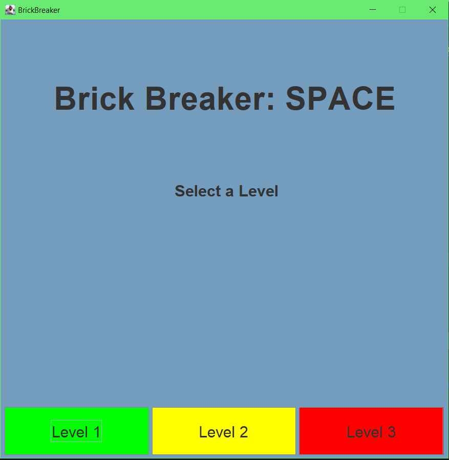
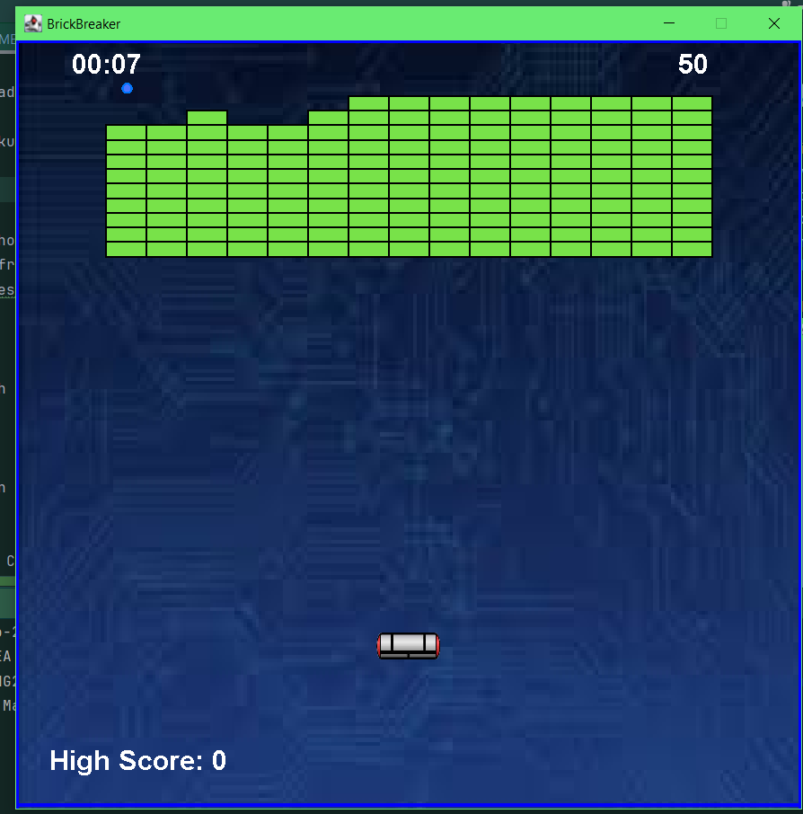

# Brick Breaker
BrickBreaker, the classic arcade game but with a space theme.Players can navigate through a title screen menu to start and exit from the game. Players move their paddle left and right to deflect the ball upwards and crush the blocks. Each level increases the difficulty. Players can earn power ups that can temporarily make the paddle bigger, slow down the ball, or give you multiple balls to use.

Adding an screenshot or a mockup of your application in action would be nice. 


# How to run
Provide here instructions on how to use your application.   
- Download the latest binary from the Release section on the right on GitHub.  
- On the command line uncompress using
```
tar -xzf  
```
- On the command line run with
```
./hello
```
- You will see Hello World! on your terminal.

### How to build
- Use this github repository: Clone or download the repository onto your local device. 
- Use InteliJ 11
- add the Apache Commons Lang 3.14.0 (Java 8+) binary in the projects dependencies.
  - https://commons.apache.org/proper/commons-lang/download_lang.cgi
- In the main file run and compile as usual.
- Once the file is running the game should open in a new window.

### project proposal
This document proposes a novel application of BrickBreaker, the classic arcade game but with a space theme. Players can navigate through a title screen menu to start and exit from the game. Players move their paddle left and right to deflect the ball upwards and crush the blocks. Each level increases the difficulty.

